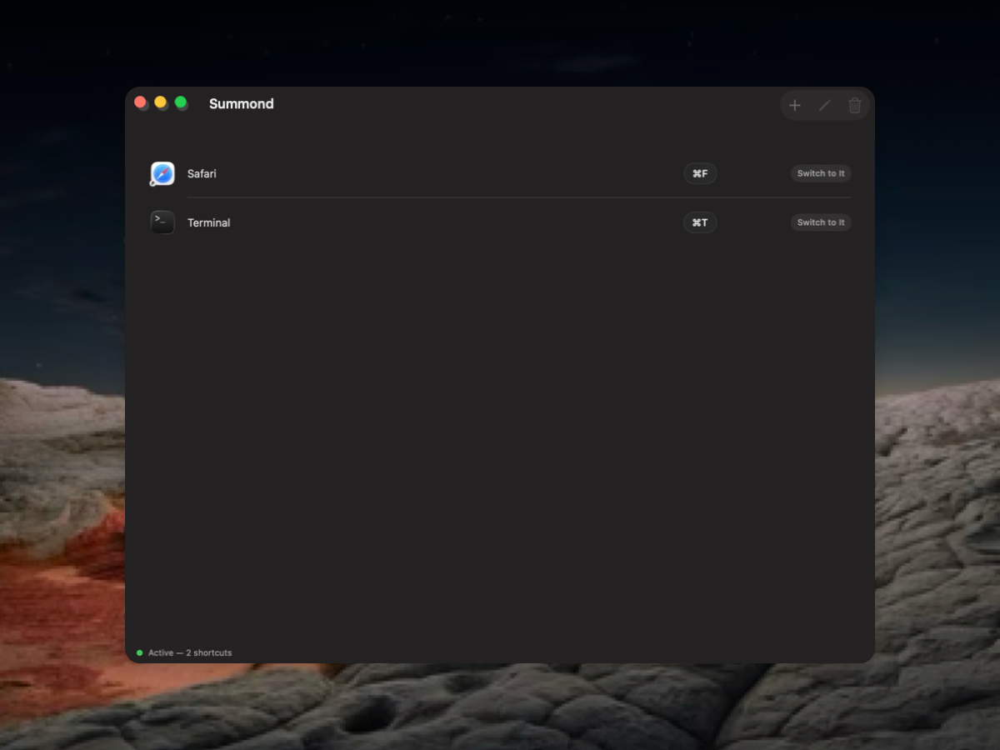
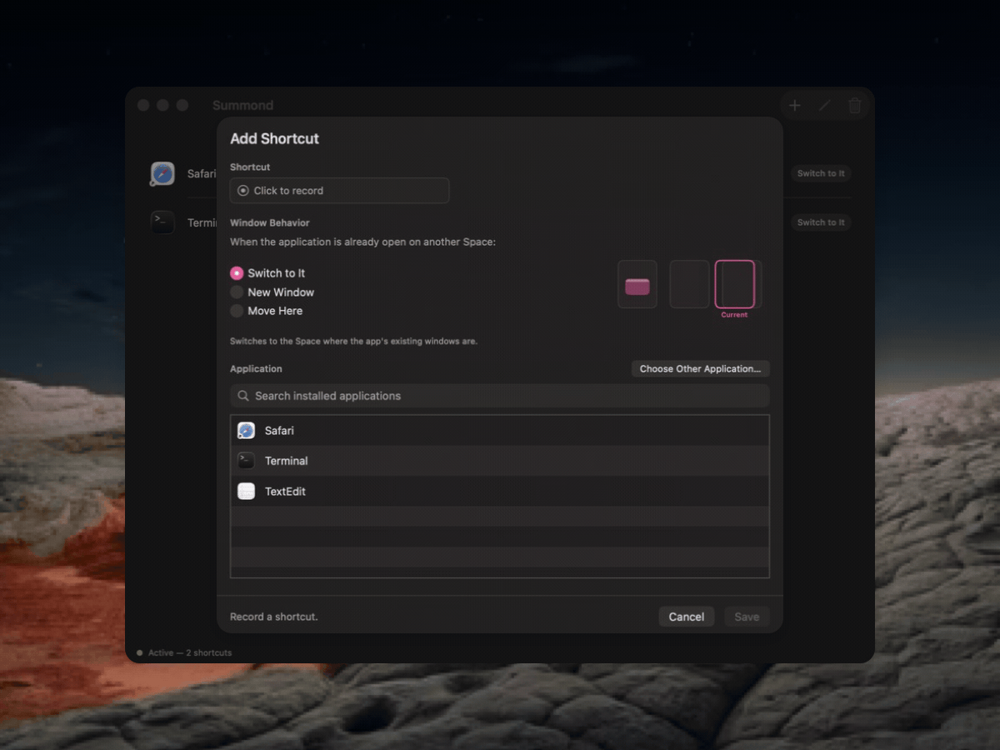

# Summond

Summond is a macOS app and background agent that summons app windows from a
global shortcut: it opens, focuses, or moves a target app's windows onto your
current Space. Summond edits shortcuts, the LaunchAgent intercepts
key events, and an optional menu bar item shows agent health.





## Status

Summond is at its first release (1.0) and under active development. Every push
to `main` and every pull request runs `make lint`, `make core-test`, and
`make app-test` on GitHub Actions (`.github/workflows/ci.yml`). The GUI and
VM-only suites (`make test-tart`, `make smoke-tart`) are maintainer-run and not
part of CI.

## Requirements

- macOS 26.0+
- Xcode 26+
- [XcodeGen](https://github.com/yonaskolb/XcodeGen) 2.45+
- [Tart](https://tart.run/) for `make test-tart` and `make smoke-tart`
- Accessibility permission for the `Summond` entry that represents the
  bundled `SummondAgent` helper
- Input Monitoring permission for the `Summond` entry that represents the
  bundled `SummondAgent` helper
- Login Items approval for the bundled LaunchAgent when macOS asks for it

## Install

1. Drag `Summond.app` to `/Applications`.
2. Open `Summond.app`.
3. Click **Enable Service**.
4. If the service shows **Requires Approval**, open System Settings > General >
   Login Items & Extensions and approve Summond.
5. Grant Accessibility permission to the `Summond` helper entry in System
   Settings > Privacy & Security > Accessibility.
6. Grant Input Monitoring permission to the `Summond` helper entry in System
   Settings > Privacy & Security > Input Monitoring.

The app installs its service from inside the bundle with `SMAppService`. The
agent runs only in your Aqua login session.

## Configure Shortcuts

Use the shortcuts list in `Summond.app` to add, edit, or delete shortcuts.
You can search installed apps or choose a `.app` bundle manually. The shortcut
recorder accepts supported keys with optional modifiers. Function and navigation
keys may be used without modifiers; literal keys require Command, Option, or
Control so shortcuts cannot silently shadow normal typing.

Supported modifiers:

- `command`
- `shift`
- `option`
- `control`

Representative supported keys include letters, numbers, function keys
`f1`-`f20`, arrows, `home`, `end`, `pageup`, `pagedown`, `space`, `tab`,
`return`, `escape`, `delete`, and common punctuation.

### Shortcut Behaviors

**Switch to It** performs a normal app launch or activation.

**New Window** prefers a window on the current Space, detected via
runtime-resolved private SkyLight queries. If the app is running but has no
window on the current Space, Summond asks the Dock for the app's **New Window**
menu item, waits for a window on the current Space, and then activates the app.
If Dock menu access, window creation, or activation fails, the shortcut is still
consumed and the failure is logged.

**Move Here** brings existing windows to the current Space when possible. It uses
private SkyLight window-server functions because macOS has no public API for
moving another app's windows between Spaces. On supported macOS 26+ systems,
this uses the bridged window-management path that works without disabling SIP.
If the underlying functions disappear in a future macOS release, the move is
logged as a non-fatal failure.

## Menu Bar Item

Enable the menu bar item from Summond. It is installed as the
bundled login item `SummondStatus.app` and shows agent reachability,
Accessibility, Input Monitoring, shortcut listener, and configuration state. Its
menu opens Summond and offers a contextual recovery action when attention is
needed.

## Troubleshooting

If the service shows **Requires Approval**, approve Summond in System Settings >
General > Login Items & Extensions.

If shortcuts stop working after rebuilding or re-signing the app, macOS may have
revoked Accessibility trust for the old signature. Reset it and grant permission
again:

```bash
tccutil reset Accessibility net.garaba.summond.agent
tccutil reset ListenEvent net.garaba.summond.agent
```

Stream Summond logs:

```bash
log stream --predicate 'subsystem == "net.garaba.summond"'
```

Useful local build checks:

```bash
make project
make build
make test
```

## Build From Source

Show the available build, test, lint, and packaging commands:

```bash
make help
```

Generate the Xcode project:

```bash
make project
```

Build the Debug app:

```bash
make build
```

Run the host unit test suite:

```bash
make test
```

Run unit and UI tests in a clean disposable Tart VM:

```bash
make test-tart
```

The XCUITest UI suite is intended to run via `make test-tart`, is excluded from
host `make test`, and can be forced on a host with `ALLOW_HOST_UITESTS=1`.
`make test-tart` clones a disposable VM from a
reusable base named `summond-macos-tahoe-xcodegen-base` (created automatically by
`scripts/tart-ensure-base.sh` if missing) and runs `make test ui-test` there. Use
`BASE_VM=<name>` to choose a different prepared base, or
`SUMMOND_TART_SOURCE_IMAGE=<image>` when creating the base VM. `make smoke-tart`
separately runs only the unattended launchctl/mach-service smoke.

See [ARCHITECTURE.md](ARCHITECTURE.md) for the full coverage boundary, including
which scene-layer behaviors remain manual-test-only.

Run only Core package tests or only Xcode app tests:

```bash
make core-test
make app-test
```

Run formatting checks:

```bash
make lint
```

Create local release artifacts:

```bash
SIGNING_IDENTITY="Apple Development: Your Name (TEAMID)" make release-local
```

`make release-build` is an alias for `make release-local`; it creates a signed
Release app and zip without notarization for local validation.

Create Developer ID artifacts and submit them for notarization:

```bash
TEAM_ID=TEAMID \
NOTARY_PROFILE=summond-notary \
SIGNING_IDENTITY="Developer ID Application: Your Name (TEAMID)" \
make release
```

See [ARCHITECTURE.md](ARCHITECTURE.md) for the bundle layout, XPC boundary,
storage format, and release signing flow.

## Private API Limitation

Summond resolves private SkyLight window-server functions at runtime. **New
Window** uses them for current-Space membership queries; **Move Here** uses them
for membership and for moving windows between Spaces. **Switch to It** uses only
public APIs. macOS does not officially support these SkyLight entry points, and a
future release can break them without warning. Summond degrades to a logged,
non-fatal failure when they are unavailable. See
[`Core/Sources/SummondCore/SpaceMover.swift`](Core/Sources/SummondCore/SpaceMover.swift)
and [THIRD_PARTY_NOTICES.md](THIRD_PARTY_NOTICES.md).

## Contributing

Contributions are welcome. See [CONTRIBUTING.md](CONTRIBUTING.md) for the setup
and the checks CI runs, and [SECURITY.md](SECURITY.md) to report vulnerabilities.

## License

Summond is released under the [MIT License](LICENSE). Third-party notices are in
[THIRD_PARTY_NOTICES.md](THIRD_PARTY_NOTICES.md).
